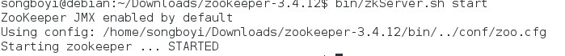

# Homework B-C: Kafka cluster setup.

## 1. Setup Kfaka

#### 1.1  Zookeeper setup

**Step 1:** Download and extract Zookeeper.

-  Visit <http://zookeeper.apache.org/releases.html> and download the Zookeeper installation package.

- Extract Zookeeper

  ```shell
  $ tar -zxf zookeeper-3.4.12.tar.gz
  $ cd zookeeper-3.4.12
  ```

**Step 2:** Setup configurations.

```shell
$ mkdir data
$ vim conf/zoo.cfg
tickTime=2000
dataDir=../data
clientPort=2181
initLimit=5
syncLimit=2
```

**Step 3:** Start and connect to the Zookeeper server.

- Start the server

  ```shell
  $ bin/zkServer.sh start
  ```

- The result is shown as follows.



- Start the CLI which will connect to the server

  ```shell
  $ bin/zkCLI.sh 
  ```

  
  
  


- It shows that Zookeeper has been successfully installed.

#### 1.2Kafka Setup

**Step 1:** Download and extract the package.

- Visit <https://www.apache.org/dyn/closer.cgi?path=/kafka/0.9.0.0/kafka_2.11-0.9.0.0.tgz> and download the Kafka package.

- Extract the package.

  ```shell
  $ tar -zxf kafka_2.11.0.9.0.0 tar.gz
  $ cd kafka_2.11.0.9.0.0
  ```

**Step 2:** Start the server.

- A Zookeeper server should be started beforehand.

  ```shell
  $ bin/zookeeper-server-start.sh config/zookeeper.properties
  ```

- Then start the Kafka server.

  ```shell
  $ bin/kafka-server-start.sh config/server.properties
  ```

- Lots of logs are shown in the shell. We just post a part of them.

  


#### 1.3 Consumer and Producer

**Step 1:** Setup

- We use python 2.7 to develop the producer and consumer

- First, we install the Kafka package of python

  ```shell
  $ pip install kafka
  ```

**Step 2:** Start the *Topic*

- We start a new topic named "counter"

  ```shell
  $ bin/kafka-topics.sh --create --zookeeper localhost:2181 --replication-factor 1 --partitions 1 --topic counter
  ```

**Step 3:** The producer

- The   producer is to generate 100 random integers once at a time, and send them to the "counter" topic.

  ```python
  from kafka import KafkaProducer
  import random

  producer = KafkaProducer(bootstrap_servers='localhost:9092')

  for i in range(50):
      num = str(random.randrange(0, 10))

      producer.send('counter', str.encode(num))

  producer.close()
  ```

**Step 4:** The consumer

- The consumer collects the data produced by the producer, and calculate the sum of them.

  ```python
  from kafka import KafkaConsumer

  tot = 0
  consumer = KafkaConsumer('counter', bootstrap_servers=['localhost:9092'])

  for msg in consumer:
      recv = "%s:%d:%d: key=%s value=%s" % (msg.topic, msg.partition, msg.offset, msg.key, msg.value)
      tot += int(msg.value)
      print "The sum of the first ", msg.offset, "received is", tot
  ```

**Step 5:** Results

- First we run *consumer.py* to listen to all messages.

- Then, we repeatedly run *producer.py* in another terminal to send a lot of numbers to the topic.

- Part of the results is shown as follows.

  


## 2. Quantitative analyzing

#### 2.1. Producer test

- We use bin/kafka-producer-perf-test.sh to test the producer.
- First, we create two brokers and several topics with different partition number and replication number to meet our test requests.
- We use different partition numbers, replication numbers, batch sizes and record sizes to test the producer, and the results are as follows.
- Here are test results with different partition numbers. We can see that the larger the partition number is, the lower the throughput(records/sec) will be.


- Here are test results with different replication numbers. We can see that the larger the replication number is, the lower the throughput(records/sec) will be.


- Here are test results with different batch sizes. We can see that the larger the batch size is, the higher the throughput(records/sec) will be. However, we can still see that if the batch size is larger than 30000, the throughput barely increases.


- Here are test results with different record sizes. We can see that the larger the record size is, the lower the throughput(records/sec) will be.


#### 2.2. Consumer test

- We use bin/kafka-consumer-perf-test.sh to test the consumer.

- We use different partition numbers and thread numbers to test the consumer, and the results are as follows.

- Here are test results with different partition numbers. We can see that the larger the partition number is, the lower the throughput(records/sec) will be.


- Here are test results with different thread numbers. We can see that the more the threads are, the higher the throughput(records/sec) will be.


