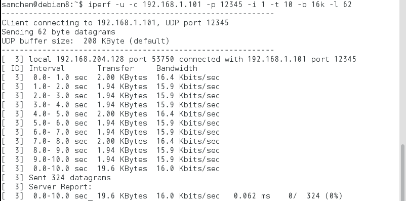

# 网络性能指标

## 带宽（吞吐量）  
单位时间内传输的数据量，单位通常是每秒比特数，记作bps；  
带宽反映了网络的传输能力，越大越好；  
## 丢包  
数据包丢失个数，等于“发送数据包数” － “接受数据包数”；  
丢包反映了网络可靠性，越小越好；  
## 时延  
数据包从发送开始到接收到该数据所耗费的时间，单位通常是毫秒；  
时延反映了网络的速度，越小越好；  
## 抖动  
指时延的变化，即两个数据包时延的差值；  
抖动反映了网络的稳定性，越小越好；  
## 乱序  
指接收到的数据包顺序和发送顺序不一致的次数；  
乱序反映了网络的稳定性，越小越好；  
当乱序比较严重时，丢包也会比较严重，所以一般都以丢包指标为主，忽略乱序指标； 

# 测试环境及方法
环境：Linux  
方法：  
ping 命令：可以测试时延和丢包，缺点是无法测试带宽；  
iperf 命令：可以测带宽，丢包，抖动， 但是测不了时延；  
free 命令：查看内存使用；  

# 结果
测试1：  
$ping www.baidu.com -c 10 -s 1024  
结果:  
  
  
  
包的大小为1024字节，发送了10个包，丢包率0，  
最小时延4.934ms，最大时延25.100ms，平均时延10.761ms，时延标准差5.777ms
  
测试2：  
$ping 8.8.8.8 -c 50 -s 1024  
结果：  
  
  
  
包的大小为1024字节，发送了50个包，得到了44个包，丢包率12%，  
最小时延291.646ms，最大时延361.155ms，平均时延297.674ms，时延标准差10.804ms  

测试3：  
结果：  
  
   
   
 在带宽16K下，丢包率0，平均抖动0.062ms  
 
测试4（内存测试）：  
结果：  
  
  
  
Mem中，Total=used+free，总内存480MB，快满了
  
-/+buffers/cache中，free=free(mem)+buffers+cached
  
Swap表示交换区，used为266，说明内存资源比较充足。
  
总内存约0.5GB，其中系统空闲内存6MB，其中buffers占用了3MB，cached占用了113MB；而对于应用程序来说，可用的内存有123MB，其中包含了buffers和cached大小。
  
应用程序可用内存/系统物理内存>70%时，表示系统内存资源非常充足，不影响系统性能。
  
应用程序可用内存/系统物理内存<20%时，表示系统内存资源紧缺，需要增加系统内存。
  
20%<应用程序可用内存/系统物理内存<70%时,表示系统内存资源基本满足应用需求，暂时不影响系统性能。
