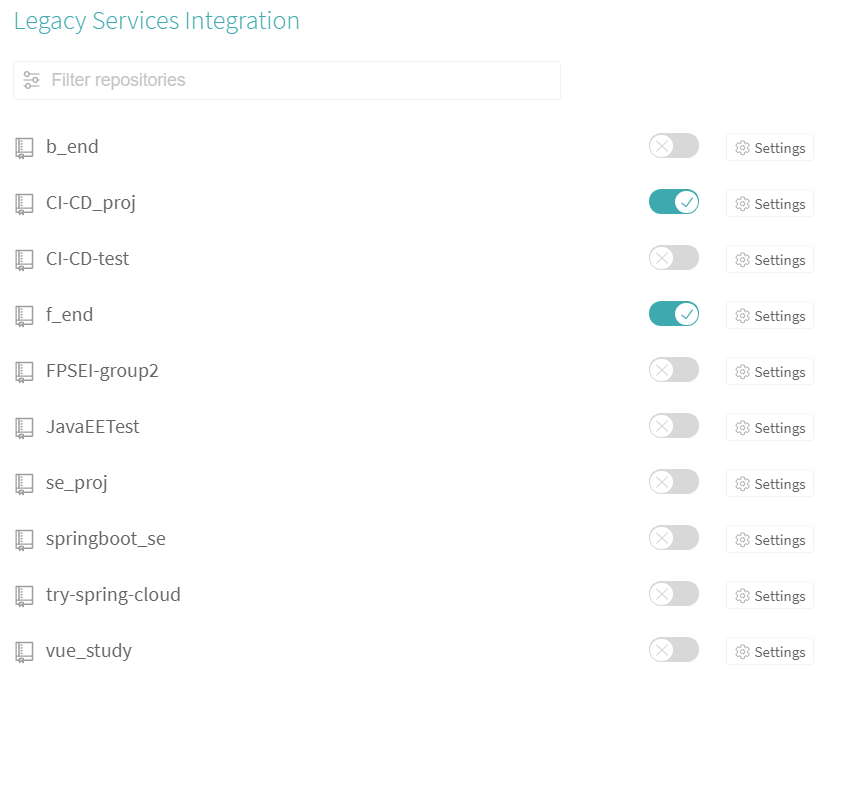
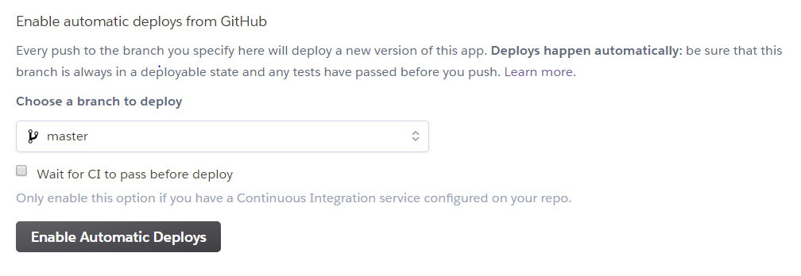

# CI/CD 环境搭建及测试 #

## 用Travis CI,Github,Heroku 搭建CI/CD 环境 ##

### 前提 ###

有一个github账户，注册一个heroku账户。

### Travis CI ###
Travis CI 提供的是持续集成服务（Continuous Integration，简称 CI）。它绑定 Github 上面的项目，只要有新的代码，就会自动抓取。然后，提供一个运行环境，执行测试，完成构建，还能部署到服务器。  
操作步骤：  
1. 登录travis ci 官网，点击右上角的个人头像，使用 Github 账户登入 Travis CI。  
2. Travis 会列出 Github 上面你的所有仓库，以及你所属于的组织。此时，选择你需要   
Travis 帮你构建的仓库，打开仓库旁边的开关。一旦激活了一个仓库，Travis 会监听这个仓库的所有变化。  
  
3. Travis 要求项目的根目录下面，必须有一个.travis.yml文件。这是配置文件，指定了 Travis 的行为。  
该文件必须保存在 Github 仓库里面，一旦代码仓库有新的 Commit，Travis 就会去找这个文件，执行里面的命令。  
4. 按照官网文档配置完毕后，回到官网，以后一有commit 只要显示如下图，CI就完成了，否则就是错误  
   
  
### Heroku ###
1. 下载heroku  
2. 找个没人用的英文名新建服务器  
  
3. 关联github  

4. 找到自己想要自动CD的库  
5. 点击 eanble automatic deploys。就会每次提交到 Github 的时候自动部署到新建的服务器上。  
  
